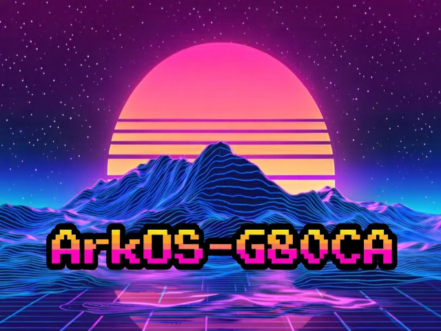

# ArkOS-G80CA-MB

For God's sake, I brought another cheap Chinese game console!

It turned up, and as most know, buying a R36S from [[Aliexpress](https://www.aliexpress.com/item/1005010419704093.html?spm=a2g0o.order_list.order_list_main.11.1d071802Kznq7y is like playing Russian Roulette.

Thanks to the great resources over at [Handheld Wiki](https://handhelds.wiki/R36S_Clones), I was able to identify that it was a G80CA-MB V1.2-20250422.

Obviously, the included firmware is less than optimal, so I went on the hunt.

Tried [ArkOS4Clone](https://github.com/lcdyk0517/arkos4clone) but the controller mapping needed a lot of work, and the Dreamcast performance was a bit hit and miss.

Downloaded [ArkOS for K36](https://github.com/AeolusUX/ArkOS-K36) and updated the DTB to Panel 8, which worked. The controls, however, were all over the place as this clone of a clone of a clone has been put together with gaffer tape using random parts.

Spent a minute trying to figure it out, then it all came flooding back like a bad case of PTSD.

## Function Button

Thanks to chaoso85 over at retrohandhelds discord for the panel 9 DTB with the fixed-function button, we were able to integrate the panel 8 config into the panel 9 DTB. I have also updated his panel 9 DTB to enable 1512MHz and included both in the [DTB Folder](https://github.com/southoz/ArkOS-G80CA-MB/tree/main/DTB). I did test the Panel 9 DTB on my Panel 8, and all the keys are mapping to the same buttons, so it should just drop in with a rename, allowing Panel 9 devices to use the firmware without key remapping.

## Wireless

Tried several external Wireless Adapters, and the OTG port doesn't provide enough power even for low-end wireless N adapters. The RL8188EU drivers are installed in the image; if anyone can test.
