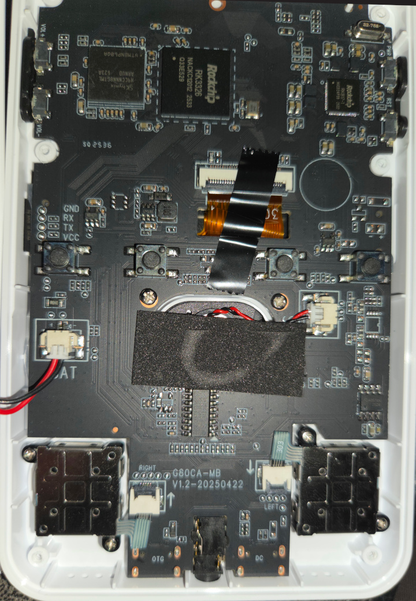

# Important Notice

**ArkOS has been retired.** dArkOS is the future of ArkOS, and it's available now. 

Try [dArkOS-G80CA-RE](https://github.com/southoz/dArkOS-G80CA-RE) for the G80CA V1.2 Panel 8 and Panel 9.

# ArkOS-G80CA-MB

For God's sake, I brought another cheap Chinese game console!

It turned up, and as most know, buying a R36S from [Aliexpress](https://www.aliexpress.com/item/1005010419704093.html?spm=a2g0o.order_list.order_list_main.11.1d071802Kznq7y) is like playing Russian Roulette.

Thanks to the great resources over at [Handheld Wiki](https://handhelds.wiki/R36S_Clones), I was able to identify that it was a G80CA-MB V1.2-20250422.

## Wiki

For firmware information, installation instructions, and game controls, check the [Wiki](https://github.com/southoz/ArkOS-G80CA-MB/wiki)

## Panel Version

The image comes with the Panel 8 DTB file. To change it to Panel 9, download the [Panel 9 DTB](https://github.com/southoz/ArkOS-G80CA-MB/blob/main/DTB/Panel%209/rf3536k4ka.dtb.panel9fnfix.1512MHz), rename it to rf3536k4ka.dtb and copy it to the BOOT partition, replacing the existing rf3536k4ka.dtb. MinZE over at the retrohandhelds discord has confirmed that a Panel 9 G80CA-MB is working with the DTB.

## Function Button

Thanks to chaoso85 over at retrohandhelds discord for the panel 9 DTB with the fixed-function button, we were able to integrate the panel 8 config into the panel 9 DTB. I have also updated his panel 9 DTB to enable 1512MHz and included both in the [DTB Folder](https://github.com/southoz/ArkOS-G80CA-MB/tree/main/DTB). I tested the Panel 9 DTB on my Panel 8, and all the keys map to the same buttons, so it should just drop in with a rename, allowing Panel 9 devices to use the firmware without key remapping.

## Wireless

Tried several external Wireless Adapters, and the OTG port doesn't provide enough power even for low-end wireless N adapters. The RL8188EU drivers are installed in the image; if anyone can test.
